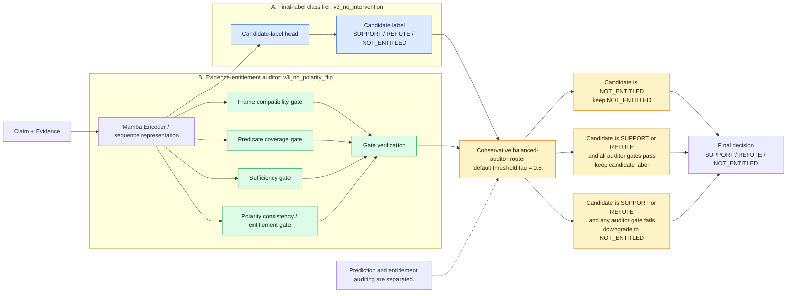

# ContraMamba-CAR Architecture Diagram

## Architecture figure



The standalone Mermaid source is available at [`docs/figures/contramamba_car_architecture.mmd`](figures/contramamba_car_architecture.mmd).

## Figure caption

**ContraMamba-CAR separates final-label prediction from evidence-entitlement auditing. A classifier proposes a SUPPORT/REFUTE/NOT_ENTITLED decision, while a balanced auditor checks frame compatibility, predicate coverage, sufficiency, and polarity consistency. The conservative router retains entitled SUPPORT/REFUTE predictions and downgrades unsupported entitled predictions to NOT_ENTITLED.**

## Method explanation

ContraMamba-CAR is a multi-layer classifier-auditor routing architecture rather than a single softmax classifier. The main configuration uses `v3_no_intervention` as the classifier and `v3_no_polarity_flip` as the balanced auditor. Both use the ContraMamba Mamba-based sequence architecture, but they are optimized for different roles:

- The classifier is optimized for final-label strength and proposes `SUPPORT`, `REFUTE`, or `NOT_ENTITLED`.
- The auditor is optimized for intervention-level entitlement behavior. It checks frame compatibility, predicate coverage, evidence sufficiency, and polarity consistency/entitlement.
- The conservative router combines these roles without reducing evidence entitlement to one confidence score.
- The operative question is whether a proposed support or refute decision is justified by the supplied evidence.

The figure uses one conceptual encoder node to keep the method diagram compact. In the main evaluated system, the classifier and balanced auditor are separately trained model instances with the roles shown by the two branches.

## Router decision rule

```text
if classifier_label == NOT_ENTITLED:
    final_label = NOT_ENTITLED
elif (frame_gate >= tau
      and predicate_gate >= tau
      and sufficiency_gate >= tau
      and polarity_gate passes):
    final_label = classifier_label
else:
    final_label = NOT_ENTITLED
```

The default operating point is `tau = 0.5`. The threshold applies to the auditor's frame, predicate, sufficiency, and entitlement checks; polarity consistency is also required for internally faithful support/refute behavior.

## Why this is not a single-model confidence threshold

A confidence threshold asks whether one predictor is sufficiently certain about its own output. ContraMamba-CAR instead separates two functions: proposing the final label and auditing whether the evidence licenses an entitled label. The auditor's gates correspond to distinct controlled failure modes, so an unsupported `SUPPORT` or `REFUTE` output can be rejected even when the classifier itself is confident. Likewise, `NOT_ENTITLED` is a substantive final decision, not merely a low-confidence fallback.

## Paper usage note

- Use this as the main method figure for ContraMamba-CAR.
- Frame the method as controlled evidence-entitlement verification, not generic hallucination detection.
- Do not claim state-of-the-art performance or real-world deployment.
- Emphasize the separation between final-label prediction and entitlement auditing.
