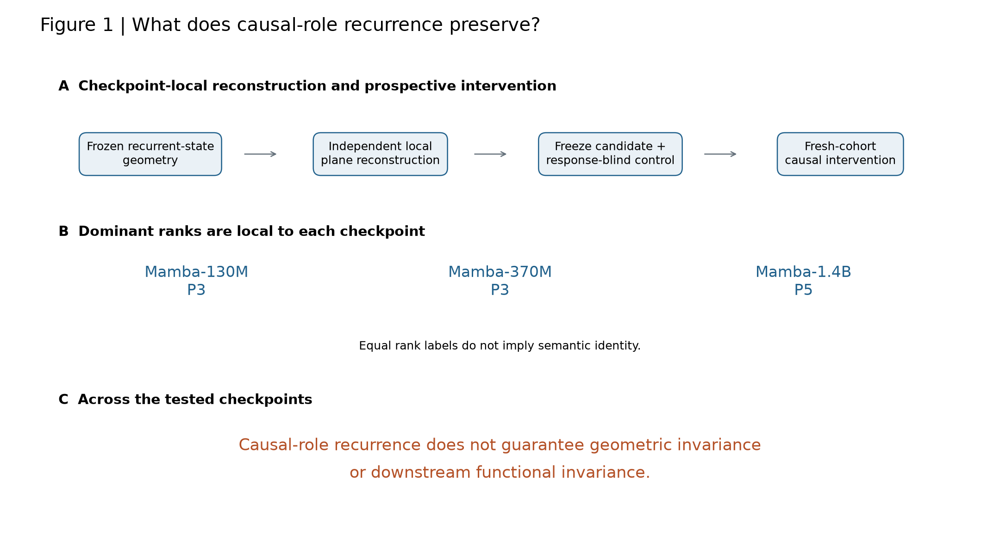
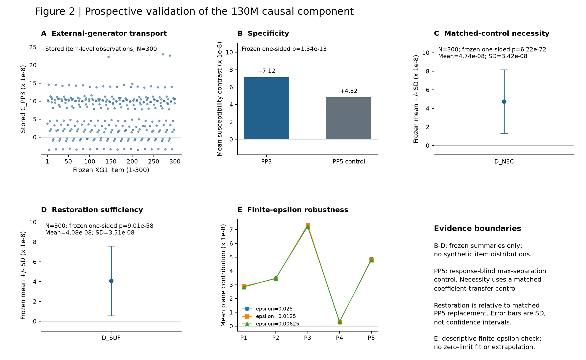
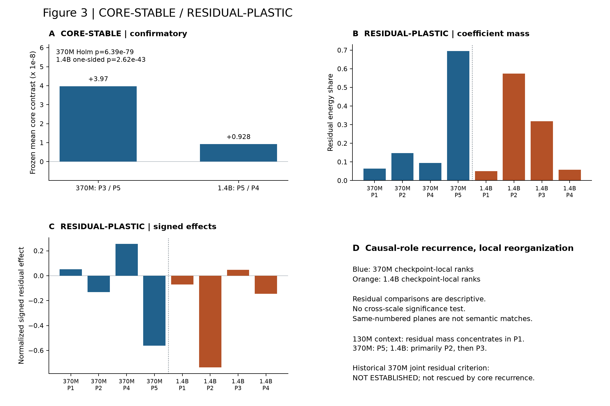
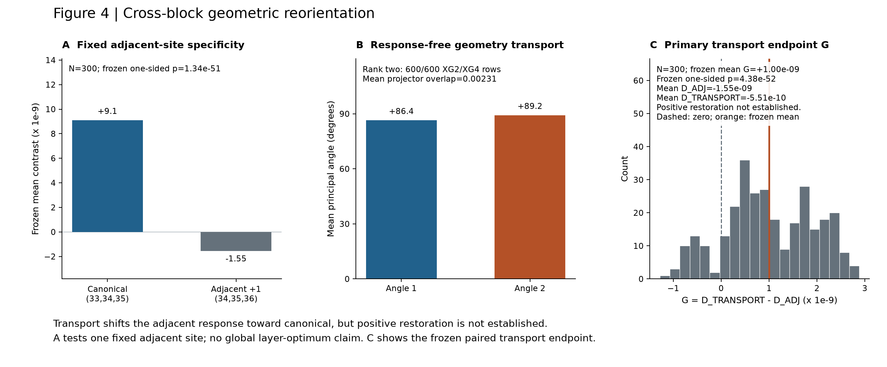
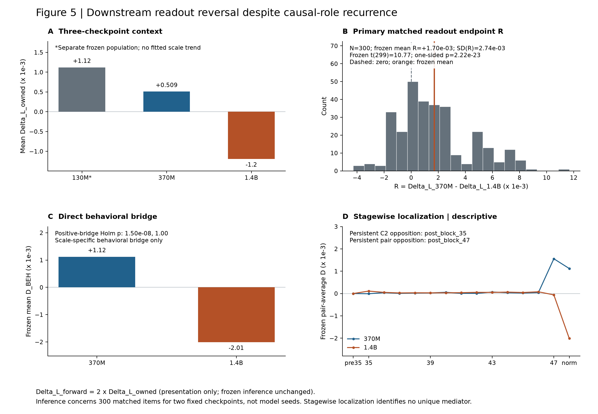

# Causal Role Recurrence with Geometric Reorganization and Readout Reversal in Mamba

## Abstract

Mechanistic analyses often ask whether an internal causal computation recurs
across model checkpoints, but recurrence does not specify what else is
preserved. We separate three properties—causal-role recurrence, geometric
realization, and downstream functional alignment—in frozen pretrained Mamba
checkpoints at 130M, 370M, and 1.4B parameters using a common causal
reconstruction and intervention program. A scale-local dominant causal role
recurs across the tested checkpoints, while its local realization reorganizes:
the selected principal-plane rank and surrounding residual structure are not
preserved as fixed coordinates. At Mamba-1.4B, transporting the canonical
subspace across an adjacent block shifts the intervention response toward the
canonical effect but does not restore its positive response, showing that
geometric reorientation contributes causally to local functional change without
fully accounting for it. Downstream functional alignment also changes. In a
prospectively matched comparison over 300 source pairs, the independently
frozen selected-versus-control displacement has positive mean task-readout
alignment at Mamba-370M and negative mean alignment at Mamba-1.4B, supporting
an orientation reversal despite recurrence of the internal causal role. Direct
behavioral interventions likewise establish a positive downstream bridge at
370M while the same pre-specified positive bridge is not established at 1.4B.
Together, these results show that, across the tested Mamba checkpoints,
recurrence of a causal role does not guarantee either a fixed geometric
realization or stable downstream functional alignment. Mechanistic
correspondences and intervention directions should therefore be revalidated
after checkpoint or scale changes rather than transferred from role recurrence
alone.

## 1. Introduction

Mechanistic analysis often asks whether an internal computation identified in
one model also appears in another. But recurrence alone leaves a more precise
question unresolved: what exactly is preserved when a causal role reappears?
A recurring role might retain the same geometric realization, the same
downstream functional alignment, both, or neither. Distinguishing these
possibilities matters whenever mechanistic correspondences are transferred
across checkpoints, scales, or intervention settings.

Mamba provides a useful setting for this question. Selective state-space
models replace Transformer attention with input-dependent state-space
dynamics while retaining competitive sequence-modeling performance
[gu2023mamba]. Their internal mechanisms have already been studied with causal
tracing and editing [sharma2024locating], token- and layer-level knockout
analysis [endy2025knockout], architecture-specific relevance propagation
[jafari2024mambalrp], and activation-subspace interventions
[mohan2026subspace]. We therefore do not ask whether Mamba contains
interpretable or causally manipulable internal structure.

Related work also shows why recurrence should not automatically be equated
with invariance. Cross-architecture studies have found substantial
mechanistic similarities alongside architecture-specific differences
[wang2025universality], and causal comparisons show that similar behavior can
be implemented by different internal retrieval mechanisms
[arora2025mechanistic]. In Mamba specifically, causal localization can be
non-unique and intervention-surface dependent [jiang2026circuit]. Mechanistic
scaling has also been studied directly in associative-recall settings
[koren2026recall]. These results establish important ingredients, but they do
not determine whether recurrence of a causally validated role across
checkpoints requires preservation of either its geometric realization or its
downstream task alignment.

We test these two implications directly in frozen pretrained Mamba checkpoints
at 130M, 370M, and 1.4B parameters. At each checkpoint, the internal geometry
is reconstructed independently rather than transferred from a smaller model.
The recurring object is therefore defined functionally: a scale-local
component that plays the dominant causal role relative to a prospectively
frozen response-blind control. Principal-plane rank is checkpoint-local and is
not treated as a semantic identifier shared across models.

The first result separates causal-role recurrence from geometric invariance.
At Mamba-130M, the starting causal component is prospectively validated by
external-generator transport, a hard response-blind geometric control,
matched-control necessity, restoration, and finite-perturbation robustness.
Applying the same scientific procedure at larger checkpoints again identifies
a dominant causal role, but not a fixed coordinate realization: the selected
rank changes and the surrounding residual mechanism reorganizes in signed
effects, coefficient-mass distribution, dominant residual rank, and
generator-family coupling. We summarize this bounded pattern as
**core-stable / residual-plastic**. At Mamba-1.4B, a prospectively fixed
cross-block transport experiment further shows that geometric reorientation
is functionally relevant: transporting the canonical subspace shifts the
adjacent intervention response toward the canonical direction, but does not
restore the canonical positive effect.

The second result separates causal-role recurrence from downstream functional
invariance. We measure the local directional readout of each checkpoint's
independently frozen selected-versus-control causal displacement into the
correct-class task margin. In the primary prospectively matched comparison
over 300 source pairs, Mamba-370M has positive mean readout alignment while
Mamba-1.4B has negative mean alignment. The paired scale contrast is strongly
positive (`t(299)=10.77`, one-sided `p=2.22e-23`), and both pre-specified sign
gates pass. Mamba-130M supplies a separately frozen positive contextual point,
but we do not combine the three checkpoints into a model-size regression or
claim a parameter-count threshold.

Together, these results answer the paper's central question: across the
tested Mamba checkpoints, recurrence of a scale-local causal role preserves
neither a fixed geometric realization nor a guaranteed downstream readout
orientation. The contribution is not a new interpretability primitive, a new
form of Mamba steering, or a generic demonstration that representation and
function can differ. It is the prospective empirical separation, within one
frozen causal program, of three properties that are easy to conflate:
causal-role recurrence, geometric realization, and downstream task alignment.

Our two headline contributions are:

1. **Causal-role recurrence without fixed geometric realization.** Across the
   tested checkpoints, a scale-local dominant causal role recurs under the
   same reconstruction and matched-control procedure, while its surrounding
   geometric realization reorganizes. Cross-block transport at 1.4B shows that
   this reorientation contributes causally to local functional change without
   fully accounting for it.

2. **Downstream readout reversal despite causal-role recurrence.** In the
   prospectively matched Mamba-370M-versus-Mamba-1.4B comparison, the recurrent
   causal role couples to the downstream task margin with opposite mean local
   orientation. Thus internal mechanistic recurrence does not guarantee stable
   downstream functional alignment.

Additional experiments define the scope of these conclusions rather than a
third headline contribution. Direct behavioral intervention establishes
positive downstream coupling at 370M while the same pre-specified positive
bridge is not established at 1.4B. The frozen causal intervention also
transfers at the margin level to natural-language AVeriTeC gold-evidence
inputs at 130M and 370M, whereas a preregistered fixed-mirror steering rule
does not produce useful prediction-level control. These results distinguish
mechanistic validity, downstream alignment, external causal transfer, and
control utility as separate empirical properties.

The scope is deliberately limited. Our inference concerns fixed pretrained
Mamba checkpoints and item-level populations rather than a population of
independently trained model seeds. Residual cross-checkpoint comparisons are
descriptive, the 1.4B site-specificity test uses one prospectively fixed
adjacent site, and the AVeriTeC study uses gold evidence rather than retrieval.
We therefore do not claim a universal scaling law, a phase transition,
architecture-independent universality, complete mediation by geometric
transport, or general steering failure.

The practical implication is correspondingly bounded: when a causal role
appears to recur after a checkpoint or scale change, intervention geometry and
downstream alignment should be revalidated rather than assumed to transfer
from role recurrence alone.

---

**Figure 1. Central question and causal reconstruction.**
The analysis separates recurrence of a checkpoint-local causal role from
preservation of its geometric realization and downstream task alignment.
Principal-plane ranks are defined independently within each checkpoint.

## 2.1 Models, populations, and prospective analysis structure

We study frozen pretrained Mamba checkpoints at 130M, 370M, and 1.4B
parameters. The causal analyses operate on independently reconstructed internal
geometry at each checkpoint. Principal-plane vectors, strong-channel indices,
selected ranks, and control ranks are not transferred from one checkpoint to
another. Equal local rank labels therefore do not imply a shared coordinate
identity across models.

The synthetic causal program separates geometry construction from response
evaluation. XG2 and XG4 provide the frozen geometry used to construct paired
local subspaces, whereas the structurally independent XG1 generator provides
prospective response populations. XG1 source pairs contain the same fixed
six-cell structural design and are generated deterministically. Prospective
validation stages use disjoint source-pair ranges, with no response-dependent
pair removal, substitution, or reordering.

All Gen4 causal studies evaluate frozen checkpoints. Scientific interventions,
local gradients, and downstream readouts do not update model parameters.
Exact model, tokenizer, checkpoint, runtime, artifact, and cohort identities
are retained in the frozen provenance artifacts accompanying each experiment.

The main inferential unit throughout the prospective studies is the frozen
item or source-pair population. Cross-checkpoint tests involving 370M and
1.4B use matched source pairs where explicitly specified. These analyses do
not treat the three checkpoints as random samples from a population of
independently trained model seeds.

## 2.2 Local recurrent-state geometry and susceptibility

Within each checkpoint, the analysis uses the frozen target-token intervention
coordinate and the predeclared within-layer strong-channel mask. The mask is
constructed independently at each checkpoint using the same frozen
strong-channel rule rather than transferring channel identities across scales.

For each of XG2 and XG4, the frozen direction rows are normalized to unit norm.
Their float64 CPU uncentered second moment is eigendecomposed, and the five
largest-eigenvalue eigenvectors define the corresponding top-five local
subspace. The frozen projector-contrast construction then pairs the two
subspaces into five checkpoint-local principal planes. All sign
canonicalization and orthonormality rules are deterministic.

For a unit probe direction `w`, local directional susceptibility is measured
with the centered finite difference

`J_i(w) = [F_i(+epsilon; w) - F_i(-epsilon; w)] / (2 epsilon)`.

The primary finite-difference scale is

`epsilon = 0.025`.

For the 130M projector-contrast analysis, each paired plane contains a positive
and negative contrast mode. For plane `k`, with frozen projector-separation
weight `s_k`, the plane contribution is

`C_k(i) = (s_k / 5) * [J_i(PPk+)^2 - J_i(PPk-)^2]`.

The broader five-dimensional susceptibility endpoint used for causal
necessity and restoration is defined from the independently frozen XG2 and
XG4 bases:

`E_XG2(i,c) = (1/5) * sum_j J_i(v_XG2,j; c)^2`,

`E_XG4(i,c) = (1/5) * sum_j J_i(v_XG4,j; c)^2`,

`Q_i(c) = E_XG2(i,c) - E_XG4(i,c)`.

No basis is refit or rotated using XG1 responses.

## 2.3 Prospective causal validation at Mamba-130M

Static localization identified principal pair 3, PP3, as the dominant shared
positive projector-contrast candidate at 130M. PP3 was frozen before
prospective XG1 validation.

External-generator transport was first evaluated on a fresh 300-pair XG1
population. A second non-overlapping 300-pair population tested specificity
against PP5, selected without XG1 responses as the principal plane with
maximum frozen projector separation:

`PP5 = argmax_k sin(theta_k)`.

PP5 is therefore a response-blind hard geometric control, not a random
direction baseline.

Necessity was tested on a third fresh 300-pair XG1 population. Let `h` denote
the native strong-coordinate target state and let `u3+`, `u3-` be the frozen
orthonormal PP3 modes. Native PP3 coefficients are

`a = <h, u3+>`

and

`b = <h, u3->`.

Complete PP3 neutralization removes the native PP3 component:

`T3(h) = h - a u3+ - b u3-`.

The matched PP5 control transfers the same coefficients into the orthonormal
PP5 plane:

`T5(h) = h - a u5+ - b u5-`.

The primary necessity contrast compares the broad endpoint `Q` under these two
conditions rather than testing PP3 with its own PP3-specific response measure.
This avoids a structurally circular necessity endpoint.

Restoration was tested on a fourth disjoint 300-pair XG1 population. Define
the PP3-neutralized background

`B = h - (a u3+ + b u3-)`.

The selected restoration returns the exact removed native component:

`R3 = B + a u3+ + b u3- = h`.

The matched replacement inserts the same coefficients in PP5:

`R5 = B + a u5+ + b u5-`.

Because PP3 and PP5 are orthonormal and use the same coefficient pair, the
added components have equal Euclidean norm. The resulting comparison is a
local matched restoration/replacement test; it is not a claim that PP3 is
globally sufficient for model behavior.

Finite-epsilon robustness was assessed descriptively at `0.025`, `0.0125`,
and `0.00625` using the frozen plane construction. These checks add no new
inferential test and are not extrapolated to an `epsilon -> 0` limit.

## 2.4 Cross-checkpoint recurrence and cross-block geometric transport

For each larger checkpoint, the geometry is reconstructed independently.
On a scale-specific discovery population, define

`G_s,k(i) = Q_restored(s,k,i) - Q_neutralized(s,k,i)`.

The scale-local dominant candidate is the unique maximizer of the mean
discovery response:

`k*_s = unique argmax_k mean_i G_s,k(i)`.

A response-blind control is then selected from the remaining frozen geometry
without using the confirmation outcome. On a disjoint confirmation population
the core endpoint is

`D_CORE_s(i) = Q_restored(s,k*_s,i) - Q_control(s,c*_s,i)`.

This procedure tests recurrence of a causal role under a common scientific
protocol. It does not require the selected principal-plane rank to be the same
across checkpoints.

All planes excluding the selected scale-local component form the residual
mechanism for descriptive characterization. Residual signed effects,
coefficient-mass allocation, dominant residual rank, and generator-family
coupling are reported descriptively. No cross-checkpoint residual significance
test is assigned post hoc.

At Mamba-1.4B, site specificity is tested with a single prospectively fixed
adjacent site. The canonical source/target/intervention triplet is

`(33, 34, 35)`

and the architecture-predeclared downstream `+1` triplet is

`(34, 35, 36)`.

The adjacent direction was fixed from the validated instrumentation boundary
rather than from causal responses, and no additional neighboring site is
searched after observing the result.

To measure cross-block geometric reorientation, the frozen canonical P5
subspace is transported through the adjacent block using the frozen local
Jacobian-vector transport procedure. The transported rank-two subspace is
compared with the independently reconstructed adjacent P5 plane using
principal angles and projector overlap on response-free XG2/XG4 rows.

Functional relevance is then evaluated on the frozen 300-pair XG1 adjacent-site
response population. The prospectively defined paired transport endpoint is

`G = D_TRANSPORT - D_ADJ`.

A separate mandatory sign gate asks whether

`mean(D_TRANSPORT) > 0`.

The relative-shift test and the positive-restoration gate are kept distinct.
Ratios of canonical, adjacent, and transported mean responses are not
interpreted as mediated or explained percentages.

## 2.5 Downstream task readout and behavioral localization

The principal cross-checkpoint readout study compares Mamba-370M and
Mamba-1.4B on the same `xg1_fact_4801..xg1_fact_5100` population of 300
source pairs. Each pair contributes the two frozen behavioral cells
`C0_SHAM` and `C2_NAME`, which are averaged within pair.

For a row with correct class `y`, the native downstream task margin is

`m = z_y - max_{c != y} z_c`.

The local gradient is evaluated at the unmodified native forward state. The
upstream graph is cut at the frozen intervention tensor, which is treated as a
local differentiation leaf; the downstream computation remains intact and
model parameters receive no gradients.

Let `h` be the native strong-coordinate activation and let
`U_sel=[u_sel+,u_sel-]` and `U_ctrl=[u_ctrl+,u_ctrl-]` denote the already
frozen selected and response-blind control planes. Native selected
coefficients are reused in both component constructions:

`C_sel(h) = a u_sel+ + b u_sel-`,

`C_ctrl(h) = a u_ctrl+ + b u_ctrl-`.

The per-row local directional readout is

`Delta_L_row = g^T [C_sel(h) - C_ctrl(h)]`.

The two cells are averaged within source pair to obtain `Delta_L_s,q`.
The primary matched cross-checkpoint endpoint is

`R_q = Delta_L_370M,q - Delta_L_1.4B,q`.

The frozen `G3-GROUP-D-HALF` computation graph uses an intentional
edge-specific backward ownership factor of one half on the relevant D edge
while preserving the forward computation. Consequently, the historically
stored quantity and the numerical forward directional derivative satisfy

`Delta_L_owned = 0.5 * Delta_L_forward`,

or equivalently

`Delta_L_forward = 2 * Delta_L_owned`.

This deterministic positive rescaling changes numerical derivative units but
does not change signs, ranks, correlations, t statistics, or p-values.

Direct behavioral coupling uses the same frozen selected-versus-control
component construction. Because exact selected-component restoration returns
the native state, the behavioral contrast can be written as

`D_BEH = M_native - M_control`.

For stagewise localization, downstream margins are recorded after the frozen
layer-35 intervention under `native`, `dominant_neutralized`, and
`dominant_control` conditions. At each stage `k`,

`A_sel(k) = M_native(k) - M_neutralized(k)`

`B_ctrl(k) = M_control(k) - M_neutralized(k)`

and

`D(k) = M_native(k) - M_control(k) = A_sel(k) - B_ctrl(k)`.

Stagewise quantities are descriptive and are not assigned additional
inferential tests or interpreted as identifying a unique mediator.

## 2.6 Natural-language external transfer and steering boundary

External transfer uses the official AVeriTeC development source with annotated
gold evidence. The source contains 500 examples. The frozen compatible
three-class cohort excludes `Conflicting Evidence/Cherrypicking`, leaving
462 examples:

- `Refuted -> REFUTE`;
- `Not Enough Evidence -> NOT_ENTITLED`;
- `Supported -> SUPPORT`.

The experiment is a causal-transfer study rather than an end-to-end
fact-verification benchmark evaluation. Retrieval and question generation are
not executed. Gold question-answer evidence is serialized deterministically;
the textual justification field is not used as model input.

The frozen input contract uses claim text, an EOS separator, and gold evidence
within a maximum sequence length of 128 tokens. Model-specific tokenizer and
anchor eligibility are verified before scientific response execution, and no
favorable subset is selected after tokenization or model response.

For each compatible example, the external causal conditions are
`native`, `dominant_neutralized`, and `dominant_control` using the
checkpoint-local selected and coefficient-matched response-blind control
planes. The external endpoint is the corresponding correct-class task-margin
contrast under the frozen causal comparison.

The completed 130M/370M external tests form their predeclared transfer family.
The later Mamba-1.4B experiment is a separate prospective negative-sign
extension and does not reopen or modify that family.

Prediction-level control utility is tested separately with the preregistered
Mamba-370M fixed-mirror steering rule. Its utility endpoints count
native-wrong-to-correct transitions, native-correct-to-wrong transitions, and
net accuracy change. Causal margin transfer and prediction-level steering
utility are therefore treated as distinct empirical endpoints.

## 2.7 Statistical analysis and inferential scope

Prospective causal contrasts use the test and direction frozen before their
corresponding response populations are inspected. Positive mean causal
contrasts are generally evaluated with one-sided Student t tests on the
predeclared item or paired-difference endpoint. Matched cross-checkpoint
comparisons use the matched item differences directly.

Multiplicity correction is applied only where a prospective family explicitly
defines multiple primary tests, including the frozen two-test Holm families.
Descriptive residual decompositions, finite-epsilon profiles, geometric
transport summaries, and stagewise localization do not acquire post-hoc
p-values.

No failed historical gate is rescued by redefining its endpoint, tail,
population, plane, layer, token, or control. Likewise, the three checkpoint
means are not fit with a model-size scaling regression or used to estimate a
parameter-count threshold.

The matched Mamba-370M-versus-Mamba-1.4B readout inference concerns variation
across 300 matched source pairs for two fixed pretrained checkpoints. It does
not quantify variation across independently trained model seeds.

## 2.8 Reproducibility and provenance

Every scientific stage freezes its cohort identity, model/checkpoint identity,
tokenizer and anchor contract, geometry or intervention objects, statistical
endpoint, and artifact hashes before downstream interpretation. Raw execution
artifacts are separated from static inferential analyses and manuscript
synthesis.

The manuscript figures and Main Table 1 are generated only from the frozen
artifacts bound in
`reports/reason_router_gen4_main_figure_plot_data_manifest_v1.json`.
The renderer performs no model execution and verifies the bound source
artifacts remain byte-identical during rendering.

The current manuscript construction phase performs no new model execution,
training, endpoint selection, statistical test, or p-value computation.

---

## 3.1 Identifying a causal recurrent-state role

We first asked whether the local recurrent-state geometry contains a
reproducible causal component rather than merely a direction that covaries with
the observed susceptibility contrast. In Mamba-130M, a static decomposition of
the frozen XG2/XG4 response geometry localized the dominant shared positive
contrast component to principal pair 3 (PP3). Importantly, substantial response
remained in the other principal planes, so this localization did not imply a
one-dimensional mechanism. We therefore treated PP3 as a candidate distributed
causal component and evaluated it prospectively on fresh populations.

The first prospective test examined whether the PP3 geometry transported beyond
the generator families used to localize it. On an independent XG1 population
of 300 examples, the frozen PP3 contrast remained positive
(mean \(C_{\mathrm{PP3}}=7.12\times10^{-8}\),
SD \(=6.50\times10^{-8}\);
\(t(299)=18.97\), one-sided
\(p=1.52\times10^{-53}\)).
Thus the localized PP3 susceptibility geometry transported prospectively to a
generator population that was not used to select the plane.

Transport alone does not establish specificity: a highly separated principal
plane could produce a large response without carrying a distinctive causal
role. We therefore prospectively selected PP5 as a response-blind geometric
control because it had the largest projector-separation magnitude among the
frozen principal planes. On a second, non-overlapping XG1 holdout
(\(N=300\)), PP3 again produced a larger susceptibility contrast than this
max-separation control. Mean contrast was
\(7.12\times10^{-8}\) for PP3 and
\(4.82\times10^{-8}\) for PP5, yielding
mean \(D_{\mathrm{SPEC}}=2.30\times10^{-8}\)
(\(t(299)=7.66\), one-sided
\(p=1.34\times10^{-13}\)).
The effect is therefore not adequately explained by principal-plane separation
alone. This comparison does not establish dominance over every arbitrary or
random direction.

We next tested whether PP3 contributes causally to the observed effect. On a
third fresh XG1 population, selectively removing PP3 attenuated the frozen
susceptibility contrast more strongly than an intervention-magnitude-matched
PP5 coefficient-transfer control. The prospectively defined necessity contrast

\[
D_{\mathrm{NEC}}
=
(Q_0-Q_3)-(Q_0-Q_5)
=
Q_5-Q_3
\]

had mean \(4.74\times10^{-8}\)
(SD \(=3.42\times10^{-8}\)),
with \(t(299)=23.98\) and one-sided
\(p=6.22\times10^{-72}\).
This supports PP3 as a local necessary contributor relative to the matched
control intervention; it does not establish global behavioral necessity.

A complementary restoration experiment tested whether reinstating the native
PP3 component after its removal preferentially recovered the susceptibility
contrast. On another disjoint \(N=300\) XG1 population, restoring the exact
native PP3 component recovered more contrast than inserting an
equal-coefficient, equal-addition-norm PP5 replacement. The prospective
restoration contrast had mean
\(D_{\mathrm{SUF}}=4.08\times10^{-8}\)
(SD \(=3.51\times10^{-8}\)),
with \(t(299)=20.11\) and one-sided
\(p=9.01\times10^{-58}\).
We therefore describe PP3 as locally restoration-sufficient relative to the
matched PP5 replacement. This is not sufficiency in an otherwise empty state,
nor does it establish sufficiency for downstream task behavior.

Finally, we tested whether the identification of PP3 was fragile to the finite
perturbation scale used in the local susceptibility measurement. The spectral
ordering was unchanged at
\(\epsilon=0.025\), \(0.0125\), and \(0.00625\):
PP3 remained the unique dominant plane and its mean contribution remained
larger than PP5 at both smaller perturbations. The normalized five-plane
profiles were nearly identical, with pairwise cosine similarities above
\(0.99994\). These descriptive checks support finite-\(\epsilon\) robustness
of the PP3 localization, but they do not establish an
\(\epsilon\rightarrow0\) limit or a new causal ranking.

Together, prospective transport, geometric-control specificity, matched-control
necessity, restoration sufficiency, and small-\(\epsilon\) robustness support
PP3 as a reproducible local causal contributor to the Mamba-130M recurrent-state
susceptibility mechanism. At the same time, the persistent contribution of
secondary planes requires a distributed-mechanism interpretation rather than a
claim that PP3 is the sole causal component.

---

**Figure 2. Prospective validation of the Mamba-130M causal component.**
Independent-generator transport, the response-blind max-separation PP5 control,
matched-control necessity and restoration, and finite-epsilon robustness
validate PP3 as a reproducible local causal contributor without implying that
it is the sole causal component.

## 3.2 Causal roles recur while residual geometry reorganizes

We next asked what, if anything, remains invariant when the same causal
reconstruction procedure is applied at larger Mamba checkpoints. We deliberately
did not require a fixed principal-plane rank across models. Principal planes are
constructed independently within each checkpoint, so equal rank labels do not
imply semantic identity. The prospective invariant was instead functional: does
each independently reconstructed model contain a scale-local component that
plays the same dominant causal role relative to a response-blind matched
control?

At Mamba-370M, the frozen discovery procedure selected P3 against the
response-blind P5 control. On the fresh confirmation cohort, the dominant
contrast was positive with
mean \(D_{\mathrm{DOM}}=3.97\times10^{-8}\)
(SD \(=2.64\times10^{-8}\)),
\(t(299)=26.06\), raw one-sided
\(p=3.19\times10^{-79}\), and Holm-adjusted
\(p=6.39\times10^{-79}\). The effect was positive for 94% of matched
examples. This establishes recurrence of the dominant component at 370M.
It does not retroactively rescue the earlier 370M joint criterion, whose
separate positive-residual endpoint failed and remains not established.

The same question was then tested prospectively at Mamba-1.4B using disjoint
discovery and confirmation populations. Independent reconstruction selected P5
as the scale-local dominant candidate and P4 as the geometry-only response-blind
control. On the fresh \(N=300\) confirmation population,

\[
D_{\mathrm{CORE}}
=
Q_{\mathrm{restored}}(\mathrm{P5})
-
Q_{\mathrm{control}}(\mathrm{P4})
\]

had mean \(9.28\times10^{-9}\)
(SD \(=9.89\times10^{-9}\)),
with \(t(299)=16.25\), one-sided
\(p=2.62\times10^{-43}\), Cohen's
\(d_z=0.94\), and a positive-pair fraction of 0.783.
The pre-specified 1.4B core criterion therefore passed.

The dominant rank itself is consequently not the invariant:
the selected component is P3 at 370M but P5 at 1.4B. What recurs is the
scale-local dominant causal role under the same reconstruction and
matched-control procedure. We refer to this bounded observation as
**core-stable**. It does not imply a universal dominant rank, semantic identity
of same-numbered planes, or architecture-independent universality.

The surrounding residual geometry shows a different pattern. At 130M, the
earlier frozen characterization placed approximately 0.78 of the residual
coefficient-energy mass in local P1, with positive raw
native-neutralization attenuation across the four tested residual planes.
At 370M, residual organization shifted strongly toward local P5:
P5 carried approximately 0.695 of residual coefficient energy, and the signed
residual profile contained a large negative P5 contribution together with a
positive P4 contribution. At 1.4B, the organization changed again. Residual
coefficient mass was concentrated primarily in P2
(\(\approx0.574\)) and secondarily in P3
(\(\approx0.318\)); P2 became the dominant negative residual contributor,
while P4 was also negative and the smaller P3 term was positive.

The residual therefore remains structured rather than disappearing as the
dominant role recurs. At both 370M and 1.4B, the aggregate residual was closely
tracked by the signed sum of its constituent plane effects
(\(r=0.963\) and \(r=0.995\), respectively), arguing against an interpretation
in which the residual is dominated by a large aggregate-only interaction.
What changes is which local planes carry the state mass and signed causal
effect, together with the generator-family coupling that produces those
effects. In particular, the strongest negative residual mode at 1.4B is
generated by a different XG2/XG4 contribution pattern from the major negative
370M modes.

These residual comparisons are descriptive; no cross-checkpoint significance
test is assigned to the residual reorganization itself. Their role is to
characterize how the realization surrounding the prospectively confirmed core
changes across the tested checkpoints. The resulting pattern is therefore
best summarized as **core-stable / residual-plastic**: a scale-local dominant
causal role recurs through Mamba-1.4B, while its surrounding residual
realization reorganizes in signed effects, coefficient-mass distribution,
dominant residual rank, and generator-family coupling. This formulation does
not imply a monotonic scaling law or fixed geometric coordinates across model
checkpoints.

---

---

**Figure 3. Causal-role recurrence with residual geometric reorganization.**
A checkpoint-local dominant causal role is prospectively confirmed at larger
Mamba checkpoints while residual signed effects and coefficient-mass
organization reorganize. Residual cross-checkpoint comparisons are descriptive.

## 3.3 Cross-block transport only partially accounts for local functional change

The preceding results show that the dominant causal role can recur even as its
local geometric realization changes. We next asked whether this geometric
reorientation is functionally relevant rather than merely representational.
Mamba-1.4B provides a controlled setting for this test because the canonical
causal site and a prospectively fixed adjacent site can be compared under the
same rank-aligned measurement procedure.

We first established that the causal response is site-specific. On a fresh
\(N=300\) XG1 population, the canonical \((33,34,35)\) site produced a positive
P5-versus-P4 core contrast,

\[
D_{\mathrm{CAN}} = 9.10\times10^{-9},
\]

whereas the architecture-predeclared adjacent \(+1\) site \((34,35,36)\)
produced a negative mean contrast,

\[
D_{\mathrm{ADJ}} = -1.55\times10^{-9}.
\]

The paired canonical-minus-adjacent specificity contrast had mean

\[
S = 1.07\times10^{-8},
\]

with \(t(299)=18.46\), one-sided
\(p=1.34\times10^{-51}\). The canonical effect was positive for 0.777 of
pairs, while the adjacent response was positive for only 0.0067. This
prospective comparison establishes specificity relative to one fixed adjacent
site; it does not identify a global optimum over layers or intervention sites.

We then measured how the canonical P5 subspace transforms across the
intervening block. On 600 response-free XG2/XG4 rows, the transported
two-dimensional subspace remained rank two but was strongly reoriented relative
to the local adjacent P5 plane. The pooled principal angles were approximately
\(86.45^\circ\) and \(89.22^\circ\), and mean projector overlap was
\(0.00231\). These quantities are descriptive and were measured without access
to the subsequent XG1 response endpoint. They show that the canonical causal
plane is not propagated to the adjacent site as an approximately identical
Euclidean subspace.

To test whether that reorientation matters functionally, we transported the
canonical P5 geometry to the adjacent intervention site and evaluated the
result on the same frozen \(N=300\) response population. The transported
response remained negative on average,

\[
D_{\mathrm{TRANSPORT}} = -5.51\times10^{-10},
\]

but was shifted upward relative to the native adjacent response. The
prospectively defined paired contrast

\[
G
=
D_{\mathrm{TRANSPORT}}-D_{\mathrm{ADJ}}
\]

had mean

\[
1.00\times10^{-9},
\]

with \(t(299)=18.58\), one-sided
\(p=4.38\times10^{-52}\), and was positive for 0.867 of pairs.

Thus transporting the canonical geometry causally moves the adjacent response
toward the canonical direction. However, it does not recover the canonical
effect: the transported mean remains negative, whereas the canonical mean is
positive and an order of magnitude larger. The mandatory positive-restoration
gate therefore fails.

This result supports a bounded interpretation. Cross-block geometric
reorientation contributes causally to the local functional difference between
the canonical and adjacent sites, but geometric transport alone does not fully
account for that difference. We therefore do not interpret ratios of the mean
effects as a mediated or "explained" percentage, and we leave the remaining
functional discrepancy as an unresolved component rather than attributing it
post hoc to an additional mechanism.

---

**Figure 4. Cross-block geometric reorientation is functionally relevant but
incomplete.** The canonical 1.4B geometry is strongly reoriented across the
adjacent block. Transporting that geometry shifts the adjacent response toward
the canonical direction, while the mandatory positive-restoration criterion
remains unmet.

## 3.4 Downstream readout reverses in a matched 370M-versus-1.4B comparison

The first implication tested by Sections 3.2–3.3 concerned geometric
invariance. We next tested a distinct implication: if a causal role recurs,
does its downstream task alignment remain oriented in the same direction?

We measured the local directional readout of each checkpoint's independently
frozen selected-versus-control causal displacement into the downstream
correct-class task margin. For a native hidden state \(h\), local task gradient
\(g\), selected component \(C_{\mathrm{sel}}(h)\), and response-blind control
component \(C_{\mathrm{ctrl}}(h)\), the stored directional readout is

\[
\Delta L_{\mathrm{owned}}
=
g^\top
\left(
C_{\mathrm{sel}}(h)-C_{\mathrm{ctrl}}(h)
\right)
\]

under the frozen edge-specific gradient-ownership graph.

All three readout studies used the same `G3-GROUP-D-HALF` D-edge ownership
factor. The historical stored values therefore satisfy

\[
\Delta L_{\mathrm{owned}}
=
\frac{1}{2}\Delta L_{\mathrm{forward}},
\]

so that

\[
\Delta L_{\mathrm{forward}}
=
2\Delta L_{\mathrm{owned}}.
\]

This correction changes the numerical derivative scale but not sign, ranking,
correlation, or any of the frozen t statistics and p-values.

The primary cross-checkpoint test was prospectively fixed before Study-B
execution and compared Mamba-370M and Mamba-1.4B on the same 300 source pairs.
The scale-local selected/control geometry was P3/P5 at 370M and P5/P4 at 1.4B;
plane ranks were not reselected using the readout outcome.

The mean ownership-weighted directional readout was positive at Mamba-370M,

\[
\overline{\Delta L}_{370\mathrm{M},\mathrm{owned}}
=
+5.09\times10^{-4},
\]

but negative at Mamba-1.4B,

\[
\overline{\Delta L}_{1.4\mathrm{B},\mathrm{owned}}
=
-1.20\times10^{-3}.
\]

The prospectively defined paired endpoint

\[
R_q
=
\Delta L_{370\mathrm{M},q}
-
\Delta L_{1.4\mathrm{B},q}
\]

had mean \(1.70\times10^{-3}\) and paired SD
\(2.74\times10^{-3}\). The one-sided paired test gave

\[
t(299)=10.77,
\qquad
p=2.22\times10^{-23}.
\]

Both mandatory sign gates also passed:
the 370M mean was positive and the 1.4B mean was negative. The frozen
prospective criterion therefore supports opposite mean downstream readout
alignment between the two checkpoints.

Under the deterministic ownership correction, the corresponding numerical
forward directional derivatives are

\[
\overline{\Delta L}_{370\mathrm{M},\mathrm{forward}}
=
+1.02\times10^{-3}
\]

and

\[
\overline{\Delta L}_{1.4\mathrm{B},\mathrm{forward}}
=
-2.39\times10^{-3},
\]

with paired mean difference \(3.41\times10^{-3}\). Because this transformation
is a common positive factor of two, the paired t statistic, p-value, signs, and
rank-based conclusions are unchanged.

Mamba-130M provides a separately frozen contextual checkpoint. Its mean
ownership-weighted readout is positive
(\(+1.12\times10^{-3}\); forward-equivalent
\(+2.24\times10^{-3}\)), with the separately pre-specified positive-mean test
supported. We do not combine these three checkpoint means into a scaling
regression, monotonicity test, or estimate of a parameter-count threshold:
130M was evaluated on a different frozen population, whereas the
370M-versus-1.4B result is the matched cross-checkpoint inferential comparison.

The statistical unit of the primary reversal test is therefore the matched item
population for two fixed pretrained checkpoints. The result does not quantify
variation across independently trained model seeds and does not establish a
universal model-size phase transition.

Within that scope, the result directly answers the paper's second central
question. Recurrence of a scale-local internal causal role does not guarantee
preservation of downstream functional orientation. Across the matched
Mamba-370M and Mamba-1.4B checkpoints, the internally recurrent role couples to
the downstream task margin with opposite mean local alignment.

---

---

## 3.5 Behavioral consequences are checkpoint-dependent

The readout analysis in Section 3.4 establishes that the same scale-local causal
role can couple to the downstream task margin with opposite local alignment.
We next asked whether this difference is observable under direct intervention
rather than only through a local gradient readout.

On the prospectively shared XG1 population of 300 source pairs, Mamba-370M
showed a positive restored-versus-control behavioral contrast,

\[
D_{\mathrm{BEH}}
=
M_{\mathrm{dominant\ restored}}
-
M_{\mathrm{dominant\ control}}.
\]

The mean effect was

\[
\overline{D}_{\mathrm{BEH},370\mathrm{M}}
=
+1.12\times10^{-3},
\]

with SD \(3.33\times10^{-3}\),
\(t(299)=5.82\), Cohen's \(d_z=0.336\), and
Holm-adjusted \(p=1.50\times10^{-8}\).
The behavioral contrast was positive for 0.58 of matched pairs.
Thus the internally identified causal component reaches the downstream
correct-class decision margin at Mamba-370M.

The corresponding Mamba-1.4B mean had the opposite sign,

\[
\overline{D}_{\mathrm{BEH},1.4\mathrm{B}}
=
-2.01\times10^{-3},
\]

with SD \(5.11\times10^{-3}\),
\(t(299)=-6.82\), and Cohen's
\(d_z=-0.394\). Because the prospectively specified primary family tested for
a positive behavioral bridge, the 1.4B positive-bridge criterion did not pass.
We therefore use the bounded conclusion
**scale-specific behavioral bridge only** rather than treating the two
checkpoints as samples from a monotonic scaling trend.

This behavioral divergence is not restricted to the final output layer.
A frozen stagewise downstream analysis localized the first persistent
checkpoint opposition for the entitlement-sensitive C2 condition immediately
after the intervention block, at `post_block_35`: the 370M contrast was
positive while the 1.4B contrast was negative. The full pair-averaged
opposition became persistent only at `post_block_47`. At the final normalized
readout, the corresponding contrasts were

\[
D_{370\mathrm{M}}=+1.12\times10^{-3}
\]

and

\[
D_{1.4\mathrm{B}}=-2.01\times10^{-3}.
\]

The stagewise pattern is therefore consistent with two descriptive components:
an early entitlement-sensitive routing divergence and a late consolidation of
the aggregate downstream orientation. Final normalization further exposes the
difference, particularly through the 1.4B control contribution, but the
evidence does not identify final normalization—or any other single stage—as a
unique causal mediator.

A previously frozen Mamba-130M behavioral study provides an additional
contextual checkpoint: its restored-versus-control behavioral effect was also
positive on its own fresh population
(mean \(D_{\mathrm{BEH}}=8.33\times10^{-3}\),
one-sided \(p=2.45\times10^{-17}\)).
We do not combine the three studies into a model-size trend test because their
populations and prospective inferential families differ.

Together with the readout reversal in Section 3.4, these interventions show
that recurrence of an internal causal role does not by itself determine how
that role participates in the final task decision. Within the tested
checkpoints, internal causal recurrence and downstream behavioral alignment are
empirically separable properties.

---

**Figure 5. Downstream readout orientation reverses despite causal-role
recurrence.** The principal inferential endpoint is the matched
Mamba-370M-versus-Mamba-1.4B readout difference over 300 source pairs.
The three-checkpoint display is contextual and is not a fitted scaling trend;
behavioral localization provides supporting downstream evidence.

## 3.6 External transfer and the boundary between explanation and control

The preceding analyses use synthetic XG1 inputs designed for controlled causal
measurement. We therefore tested whether the frozen causal intervention also
produces a measurable task-margin effect on natural-language fact-verification
inputs.

The external-transfer study used the official AVeriTeC development source,
restricted prospectively to 462 examples with compatible
`Refuted`, `Supported`, or `Not Enough Evidence` labels. Inputs contained the
claim and gold evidence only. The experiment did not perform retrieval and is
not an evaluation of end-to-end AVeriTeC benchmark performance.

At Mamba-130M, the frozen selected-versus-control intervention produced a
positive mean correct-class-margin effect,

\[
\overline{D}_{\mathrm{EXT}}
=
+2.31\times10^{-4},
\]

with Cohen's \(d_z=0.120\) and Holm-adjusted
\(p=0.0104\). Mamba-370M showed a smaller but likewise supported positive mean,

\[
\overline{D}_{\mathrm{EXT}}
=
+4.56\times10^{-5},
\]

with \(d_z=0.106\) and Holm-adjusted
\(p=0.0114\). These two tests formed the prospectively frozen external-transfer
family. Thus the internally identified causal component transfers to
natural-language gold-evidence inputs at both checkpoints under the frozen
margin-level endpoint.

The later prospective Mamba-1.4B extension produced a negative point estimate,

\[
\overline{D}_{\mathrm{EXT}}
=
-7.85\times10^{-5},
\]

with \(d_z=-0.067\), \(t(461)=-1.44\), and one-sided
\(p=0.0757\). Its negative-sign gate passed, but the pre-specified alpha gate
did not. Negative external transfer at 1.4B is therefore not established.
The three checkpoints should not be interpreted as a statistically established
external sign-reversal curve.

The AVeriTeC results establish margin-level causal transfer rather than
benchmark improvement. At 1.4B, for example, all three frozen intervention
conditions produced the same argmax prediction on all 462 examples. The
130M/370M external effects are also heterogeneous by source label in descriptive
analyses, and no post-hoc subgroup inference is used here.

Finally, we tested whether a causally validated direction automatically
provides a useful control direction. At Mamba-370M, a preregistered fixed-mirror
steering intervention was evaluated on 2,799 AVeriTeC examples. Of these,
331 were natively correct and 2,468 were natively incorrect. The intervention
produced

\[
C=0
\]

native-wrong-to-correct transitions and

\[
D=0
\]

native-correct-to-wrong transitions. Native and steered accuracy were therefore
identical (\(0.1183\)), with zero correction rate, zero damage rate, and zero
net accuracy change. Because there were no discordant prediction pairs, the
pre-specified exact utility test was not estimable and its success gates did
not pass.

This null does not show that Mamba is generally unsteerable, nor does it
invalidate the causal interpretation of the identified component. It instead
marks a narrower empirical boundary: a direction can carry reproducible causal
information, influence downstream margins, and transfer to natural-language
inputs without yielding useful prediction-level control under a fixed
intervention rule.

The appropriate synthesis is therefore that **mechanistic validity and control
utility are distinct empirical questions**. For applications such as model
editing or steering, recurrence of an apparently analogous causal role across
checkpoints is not sufficient reason to assume that either its downstream
alignment or a fixed intervention direction will transfer unchanged.

---

## Main Table 1 draft — external transfer and control boundary

| Evidence | Checkpoint | N | Primary outcome | Standardized effect / utility | Frozen conclusion |
|---|---:|---:|---:|---:|---|
| AVeriTeC gold-evidence transfer | 130M | 462 | \(D_{\mathrm{EXT}}=+2.31\times10^{-4}\) | \(d_z=+0.120\), Holm \(p=0.0104\) | Positive transfer supported |
| AVeriTeC gold-evidence transfer | 370M | 462 | \(D_{\mathrm{EXT}}=+4.56\times10^{-5}\) | \(d_z=+0.106\), Holm \(p=0.0114\) | Positive transfer supported |
| AVeriTeC gold-evidence transfer | 1.4B | 462 | \(D_{\mathrm{EXT}}=-7.85\times10^{-5}\) | \(d_z=-0.067\), one-sided \(p=0.0757\) | Negative transfer not established |
| Fixed-mirror steering | 370M | 2799 | corrections \(=0\), damages \(=0\) | net accuracy change \(=0\) | Useful fixed-mirror steering not established |

This table reports causal margin transfer and a fixed steering utility test.
It does not report retrieval performance, benchmark superiority, or a general
steerability claim.

---

---

## 4. Discussion

Our results separate three properties that can otherwise be conflated in
cross-model mechanistic analysis: recurrence of a causal role, preservation of
its geometric realization, and preservation of its downstream functional
alignment. Across the tested Mamba checkpoints, these properties do not move
together.

The scale-local dominant causal role recurs under the same reconstruction and
matched-control program, but the coordinates that realize that role do not
remain fixed. The selected plane rank changes, the residual coefficient mass
redistributes, signed residual effects reorganize, and generator-family
coupling changes. We therefore interpret the cross-checkpoint result as
`CORE-STABLE / RESIDUAL-PLASTIC`: recurrence is a property of the causal role
under the frozen procedure, not evidence for a checkpoint-invariant principal
plane.

The downstream readout result provides a second separation. In the matched
Mamba-370M-versus-Mamba-1.4B population, the independently frozen scale-local
causal displacements have opposite mean alignment with the downstream
correct-class task margin. Thus recurrence of the internal causal role does
not guarantee recurrence of its downstream functional orientation. The
Mamba-130M positive readout supplies a separately frozen contextual scale
point, but it is not part of the matched 370M-versus-1.4B inferential sample
and is not used to fit a scaling law.

These observations refine what should be meant by mechanistic recurrence.
Finding an analogous causal role at another checkpoint is evidence about the
organization of causal computation, but it does not by itself establish that
the same coordinate system, intervention direction, or downstream task effect
has been preserved.

### 4.1 Geometric reorganization is functionally relevant but incomplete

The Mamba-1.4B cross-block transport experiment helps connect geometric
reorganization to causal function. The canonical P5 plane is strongly
reoriented relative to the independently reconstructed adjacent plane, and
transporting the canonical geometry into the adjacent site moves the causal
response in the canonical direction. This establishes that the geometric
change is not merely a representational relabeling.

At the same time, transport does not recover the canonical positive response.
The transported mean remains negative and fails the pre-specified positive
restoration gate. Geometric reorientation therefore contributes causally to
the local functional difference without fully accounting for it.

This distinction is important. A significant relative transport effect is not
equivalent to complete mediation, and ratios between canonical, adjacent, and
transported means do not define an explained percentage. The remaining
functional discrepancy is left unresolved rather than assigned post hoc to an
additional mechanism.

### 4.2 Downstream orientation is not fixed by internal causal recurrence

The matched readout experiment directly tests whether recurrence of the
internal role preserves its downstream orientation. The answer is negative
within the tested checkpoints. Mamba-370M has positive mean local alignment,
whereas Mamba-1.4B has negative mean local alignment on the same 300 source
pairs.

The historical stored readout values are gradient-ownership-weighted
quantities. Under the frozen `G3-GROUP-D-HALF` graph, the corresponding
numerical forward directional derivative is exactly

`Delta_L_forward = 2 * Delta_L_owned`.

This correction changes the magnitude units but not signs, rankings, paired
t statistics, or p-values. The substantive result is therefore the
cross-checkpoint orientation difference, not the factor-of-two bookkeeping
itself.

The direct behavioral intervention results are consistent with a similarly
bounded conclusion. Positive downstream behavioral coupling is established at
370M, whereas the same pre-specified positive bridge is not established at
1.4B. We therefore do not interpret the checkpoint sequence as a monotonic
behavioral scaling trend.

### 4.3 Implications for transferring mechanistic interventions

A practical implication is that intervention directions should be revalidated
after changing checkpoint or model scale. An apparently analogous causal role
may recur even when its geometric realization and downstream readout
orientation have changed.

This matters for workflows that transfer editing, steering, or mechanistic
correspondences from one checkpoint to another. The present results do not
show that such transfer generally fails. They show that recurrence of an
internal causal role is insufficient evidence, by itself, for assuming
coordinate-level or downstream-functional transfer.

The appropriate operational lesson is therefore revalidation rather than
non-transferability: checkpoint changes can preserve causal role while altering
the geometry and task coupling relevant to a particular intervention.

### 4.4 Mechanistic validity and control utility are distinct

The natural-language and steering results provide a useful boundary on the
interpretation of causal mechanisms. The frozen intervention transfers at the
correct-class-margin level to AVeriTeC gold-evidence inputs at 130M and 370M,
showing that the synthetic mechanism is not confined entirely to the XG1
generator.

However, the preregistered fixed-mirror Mamba-370M steering intervention
produces neither corrections nor damages at the prediction level. Mechanistic
validity, measurable margin influence, and useful discrete control are
therefore empirically distinct outcomes in this study.

This null result should not be generalized into a claim that Mamba is
unsteerable. Only one frozen steering transformation was tested. Conversely,
the existence of a causally validated direction should not be taken as
evidence that a fixed application of that direction will improve predictions.

---

## 5. Limitations

### 5.1 Checkpoint scope and model-seed generalization

The principal cross-checkpoint conclusions concern three fixed pretrained
Mamba checkpoints. The matched 370M-versus-1.4B inferential test estimates
variation across matched items for those two checkpoints; it does not estimate
variation across independently trained model seeds.

Accordingly, the results do not establish a population-level scaling law, a
parameter-count phase transition, a zero-crossing threshold, or a universal
trajectory with increasing model size.

### 5.2 Architecture scope

All primary evidence is obtained in the tested Mamba checkpoints. The study
does not establish architecture-independent universality and does not show
that the same recurrence/geometry/readout separation holds in Transformers or
other state-space architectures.

The paper therefore treats the result as an empirical property of the tested
Mamba program rather than a theorem about neural mechanisms in general.

### 5.3 Geometry is procedure-defined and checkpoint-local

The principal planes are independently reconstructed within each checkpoint.
Their integer ranks are local labels rather than semantic identifiers shared
across scales.

The observed causal recurrence is consequently defined with respect to the
frozen reconstruction, intervention, and matched-control procedure. Other
valid decompositions could expose complementary structure. The present study
does not claim that its selected planes are the unique causal coordinates of
the model.

### 5.4 Residual reorganization is descriptive across checkpoints

The residual signed-effect and coefficient-mass comparisons are intentionally
descriptive. No cross-checkpoint residual significance test was prospectively
frozen, and none is added after observing the results.

The `RESIDUAL-PLASTIC` label therefore summarizes the observed reorganization
across the tested checkpoints; it is not an omnibus inferential claim that
every aspect of the residual must differ between every pair of model scales.

### 5.5 Cross-block transport does not identify a complete mediator

The transported canonical geometry significantly shifts the adjacent response
toward the canonical direction, but positive restoration is not achieved.
The experiment therefore supports causal contribution rather than complete
explanation.

The remaining difference may reflect additional downstream geometry, nonlinear
state dependence, other local subspaces, or mechanisms outside the measured
intervention surface. The current evidence does not distinguish among these
possibilities.

### 5.6 Site specificity is bounded

The 1.4B site-specificity experiment compares the canonical site with exactly
one prospectively fixed adjacent `+1` site. It establishes that the canonical
site is stronger under that matched comparison.

It does not identify a global optimum over layers and does not rule out other
sites with similar or stronger causal effects.

### 5.7 Finite-difference scope

The local susceptibility program uses a primary finite-difference scale of
`epsilon=0.025`, with smaller finite perturbations used only for descriptive
robustness. Stability across the tested finite values does not establish an
exact infinitesimal limit.

### 5.8 External-validity scope

The AVeriTeC experiment uses the compatible three-class development subset and
annotated gold evidence. Retrieval is deliberately removed from the causal
transfer question.

The result therefore does not measure end-to-end fact-verification performance,
retrieval quality, benchmark superiority, or robustness to retrieved evidence
noise. The 1.4B negative external-transfer extension also does not pass its
pre-specified significance gate, so negative natural-language transfer at
1.4B is not established.

### 5.9 Steering scope

The failed steering result concerns one preregistered fixed-mirror
intervention rule at Mamba-370M. It does not evaluate adaptive steering,
optimization-based control, alternative intervention magnitudes, or different
control objectives.

No additional steering transform is introduced to rescue the null result.

### 5.10 Statistical and multiplicity boundaries

Inferential tests are attached only to endpoints prospectively designated for
inference. Descriptive analyses such as residual decomposition, cross-block
geometry summaries, and stagewise localization are not promoted to
confirmatory claims by adding post-hoc p-values.

This constraint limits the number of formal cross-analysis comparisons that
can be made, but preserves the distinction between prospectively tested
hypotheses and descriptive mechanism characterization.

---

## 6. Related Work

### Mechanistic analysis of Mamba

Prior work has already established that Mamba admits detailed mechanistic
analysis and causal intervention. Sharma et al. use causal tracing,
interchange-style interventions, information-flow analysis, and model editing
to localize factual associations in Mamba, showing that factual recall can be
assigned to specific token and layer locations despite the architecture's
differences from Transformers [sharma2024locating]. Endy et al. subsequently
adapt attention-knockout-style analysis to Mamba-1 and Mamba-2 to trace factual
information flow across tokens and layers [endy2025knockout]. Complementary
work on MambaLRP develops architecture-specific relevance propagation for
selective state-space models [jafari2024mambalrp].

These studies establish that Mamba can be localized, intervened on, and
explained. Our question begins after that point. We do not ask whether Mamba
contains an interpretable or causal internal structure, but what is preserved
when an analogous causal role recurs across pretrained checkpoints.

### Mechanistic similarity across models and architectures

Mechanistic universality work asks whether different models implement similar
internal computations. Wang et al. compare Transformers and Mambas using
interpretable features and circuit-level analysis, reporting substantial
feature similarity and structurally analogous induction circuits alongside
architecture-specific differences [wang2025universality]. Arora et al. use
causal interventions to compare retrieval mechanisms across Transformers and
state-space models, emphasizing that similar task behavior can conceal
different internal algorithms [arora2025mechanistic].

Our study is complementary to this line of work. Rather than deciding whether
two architectures or checkpoints instantiate a similar mechanism in the
aggregate, we condition on recurrence of a causally validated scale-local role
and separate two stronger implications: whether that recurrence preserves its
geometric realization and whether it preserves downstream task alignment.

### Activation subspaces, steering, and causal non-uniqueness

Recent work has also made activation subspaces explicit intervention objects in
state-space models. Mohan et al. identify activation subspace bottlenecks in
Mamba-family SSMs and manipulate them with test-time steering interventions
[mohan2026subspace]. Our use of low-dimensional causal geometry therefore is
not intended as a novelty claim by itself.

A particularly close conceptual boundary is provided by Jiang and Zhang, who
show that causal localization of a Mamba-2 state-sink phenomenon is non-unique:
different unit sets can support similar causal effects, representational
similarity need not track causal function, and conclusions depend on the
intervention surface [jiang2026circuit]. This makes generic
`representation != function` an insufficient novelty statement for our work.

The distinction tested here is cross-checkpoint and relational. We ask whether
recurrence of a causal role entails preservation of its geometry or downstream
functional orientation. The frozen experiments independently reconstruct the
geometry at each checkpoint, causally test cross-block transport, and then
evaluate a prospectively matched downstream readout endpoint.

### Scaling and checkpoint variation in Mamba

Mamba mechanisms have also been studied as a function of architecture and
capacity. Koren et al. derive and empirically validate mechanistic scaling laws
for associative recall, relating Mamba recall to an internal hashing algorithm
and to model dimensions [koren2026recall]. Such work establishes that scaling
can be studied mechanistically rather than only through aggregate performance.

Our evidence does not define a model-size scaling law. We analyze three fixed
pretrained checkpoints, and the principal cross-checkpoint inference is the
matched 370M-versus-1.4B item comparison. The 130M result is a separately
frozen contextual point. We therefore do not estimate a monotonic trend, a
parameter-count threshold, or a model-population effect across random seeds.

### Position of the present work

Taken together, prior work establishes causal localization in Mamba,
information-flow analysis, cross-architecture mechanistic similarity,
activation-subspace steering, causal-localization non-uniqueness, and
mechanistic scaling. These ingredients leave a narrower question unresolved:
what must remain invariant when a causally validated role itself recurs?

Across the tested Mamba checkpoints, our frozen program separates causal-role
recurrence from both geometric invariance and downstream functional
invariance. The contribution is therefore not a new interpretability primitive
but an empirical separation of three properties within one causal program:

`CAUSAL ROLE RECURRENCE`

does not guarantee

`FIXED GEOMETRIC REALIZATION`

and does not guarantee

`STABLE DOWNSTREAM READOUT ORIENTATION`.

This positioning is intentionally bounded to the tested Mamba checkpoints and
does not assert a first-ever priority claim or an architecture-independent
principle.

---

## References

- `[gu2023mamba]` Albert Gu and Tri Dao. *Mamba: Linear-Time Sequence
  Modeling with Selective State Spaces*. arXiv:2312.00752.

- `[sharma2024locating]` Arnab Sen Sharma, David Atkinson, and David Bau.
  *Locating and Editing Factual Associations in Mamba*. COLM 2024.
  arXiv:2404.03646.

- `[jafari2024mambalrp]` Farnoush Rezaei Jafari, Grégoire Montavon,
  Klaus-Robert Müller, and Oliver Eberle. *MambaLRP: Explaining Selective
  State Space Sequence Models*. NeurIPS 2024. arXiv:2406.07592.

- `[wang2025universality]` Junxuan Wang, Xuyang Ge, Wentao Shu, Qiong Tang,
  Yunhua Zhou, Zhengfu He, and Xipeng Qiu. *Towards Universality: Studying
  Mechanistic Similarity Across Language Model Architectures*. ICLR 2025.

- `[endy2025knockout]` Nir Endy, Idan Daniel Grosbard, Yuval Ran-Milo,
  Yonatan Slutzky, Itay Tshuva, and Raja Giryes. *Mamba Knockout for
  Unraveling Factual Information Flow*. ACL 2025.

- `[arora2025mechanistic]` Aryaman Arora, Neil Rathi, Nikil Roashan Selvam,
  Róbert Csórdas, Dan Jurafsky, and Christopher Potts. *Mechanistic
  evaluation of Transformers and state space models*. arXiv:2505.15105.

- `[mohan2026subspace]` Vamshi Sunku Mohan, Kaustubh Gupta, Aneesha Das,
  and Chandan Singh. *Interpreting and Steering State-Space Models via
  Activation Subspace Bottlenecks*. ICML 2026. arXiv:2602.22719.

- `[jiang2026circuit]` Yuhang Jiang and Bowen Zhang. *A Circuit, Not The
  Circuit: Non-Unique Causal Localisation of the Mamba-2 State Sink*.
  arXiv:2606.00930.

- `[koren2026recall]` Yuval Koren, Assaf Ben-Kish, Raja Giryes, Lior Wolf,
  and Itamar Zimerman. *On the Recall Scaling Laws in Mamba: A Theoretical
  and Mechanistic Study via Hashing*. arXiv:2609.07681.
